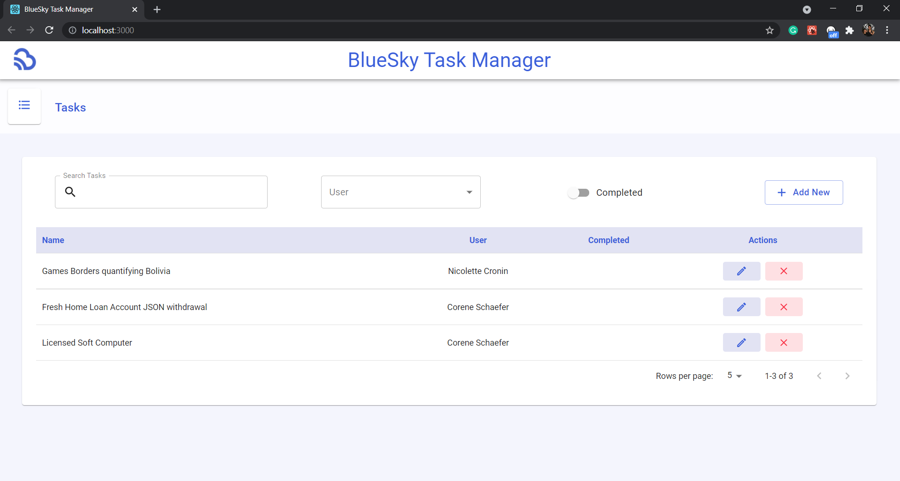
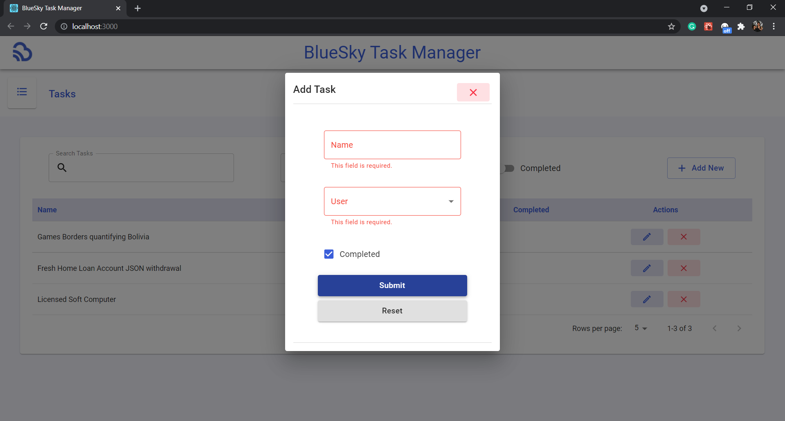
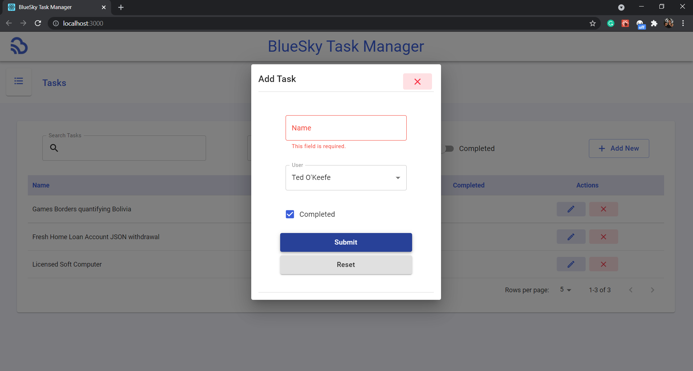
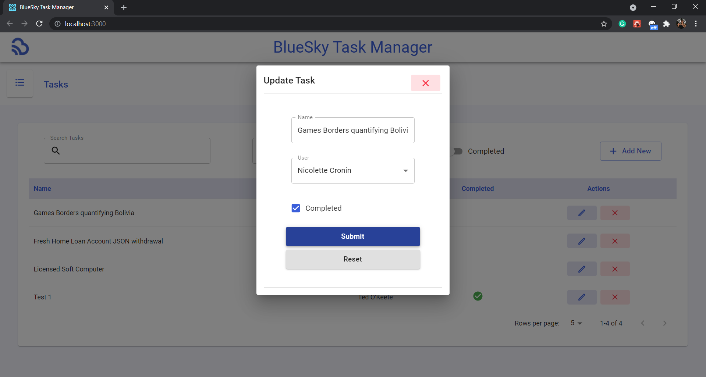
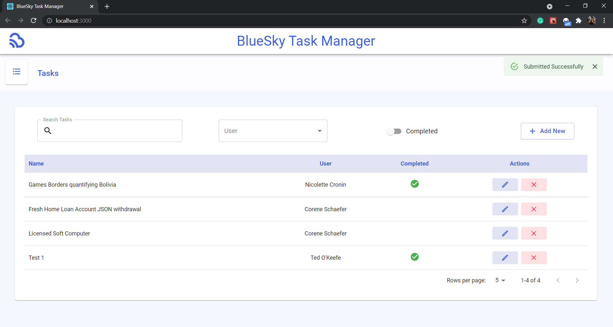
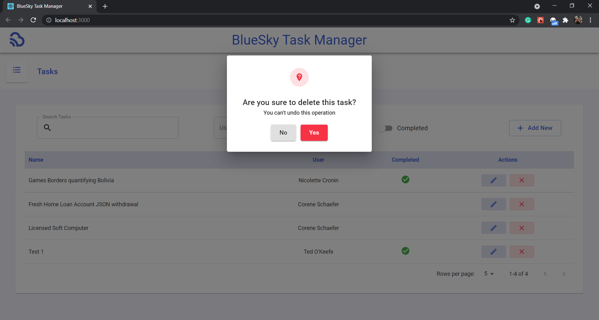
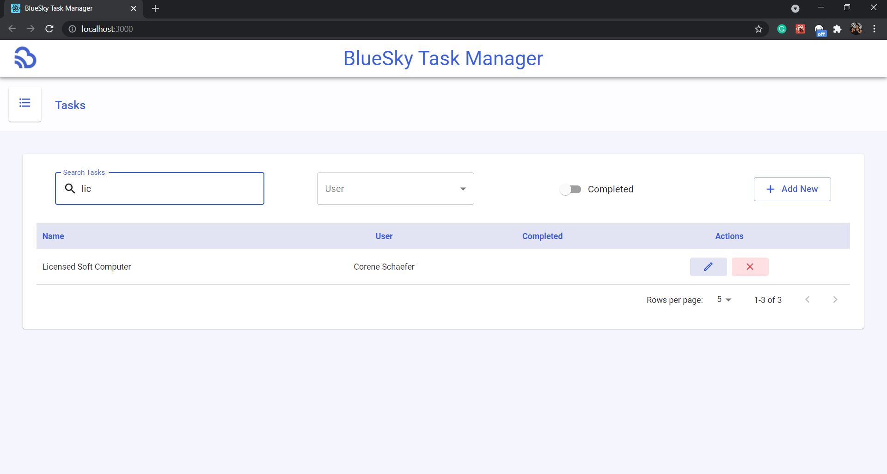
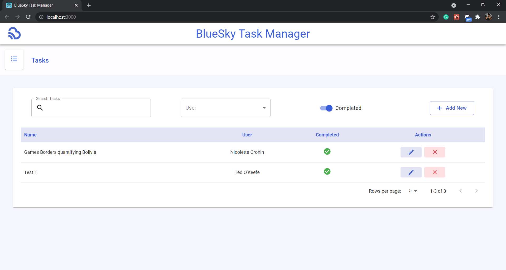
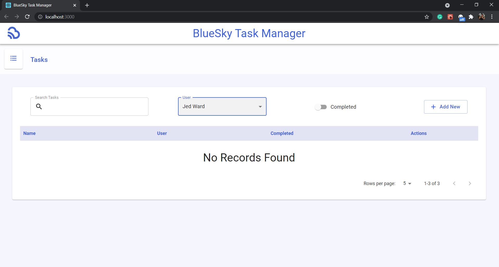

This project was bootstrapped with [Create React App](https://github.com/facebook/create-react-app).

## Steps setup to the App 
- npm install
- npm start 

## Required Packages 
some these will need to be installed and set up 
- [Material UI](https://material-ui.com/)
- [React Select](https://react-select.com/home)
- [Axios](https://github.com/axios/axios)
- Typescript

### Reqirements
- List Tasks
- Filter tasks by name, user, is completed
- Add Task
- Edit Task
- Delete Task
- Global State (React Hooks and Context Providers)

### What we are looking for
We are looking mainly at how the code is structred and organsied but we also expect you to use a ui libary to build render so it looks good.

Im you have any questions please feel free to ask, also if you need any extra api's added please feel free to reach out 

API's Already Implemented
- GET api/todos
- GET api/todo/:id
- DELETE api/todo/:id/delete
- POST api/todo/create
- GET api/users
- GET api/user/id/todos
### Mockups 

### Implementation
Retrieve tasks and users from the server.

Prompt the user when adding a task without the required fields.

Required fields are filled and submitted. Added task is displayed and the user is notified.

Update a task.

Task is updated and the user is notified.

User is asked to confirm to delete a task.

User confirms and the task is deleted. A notification is shown.

Search by task name.

Search by user.

Search by completed.

If there is no task to show.

Tasks are added to show pagination.

### - Global State (React Hooks and Context Providers)
For this requirement, please refer to TaskContext.tsx and UserContext.tsx located in src/components/contexts
